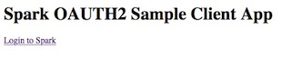
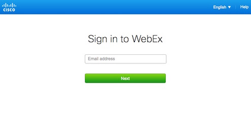
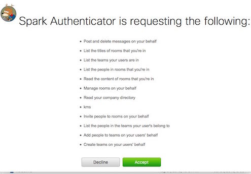
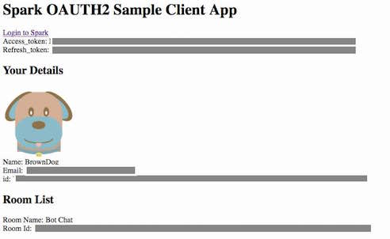
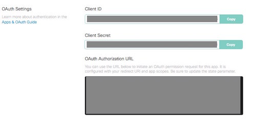

# spark\_oath2\_authenticator application

This is a basic application to handle the processing of OAUTH2 Authentication/Authorizations
from Cisco Spark.  

The flow of the OAUTH2 process is:

1. End User accesses an application that integrates with Spark

    

2. The application redirects the user to Cisco Spark to login
   * The application includes its return address in the "state" field of the request to authenticate

    


3. The User logs into Spark and Approves the access to resources

    

4. Spark redirects user to the authenticator application to complete the authorization processing.  
5. The authenticator application takes the Authorization Code from Spark, and uses it to request the Access and Refresh tokens from Cisco Spark.
   * This request includes the Client ID and Secret for the registered Integration with Spark
6. Cisco Spark validates the Authorization Code and returns an Access and Refresh Token
7. The authenticator application redirects the user back to the original application address sent in the "state" field.  The redirect is sent with the access\_token and refresh\_token included in query string parameters.

    

The authenticator application can be used by multiple end user applications.  Each application would include the same Client_ID in login requests to Spark, and include the unique URL for users to be redirected to once the authentication has completed in the "state" field.


## Cisco Spark OAUTH Information and Details

For more details on OAUTH integrations with Cisco Spark see the following resources.  

1. [Cisco Spark Documentation on Authentication](https://developer.ciscospark.com/authentication.html)
2. [DevNet Learning Lab](https://learninglabs.cisco.com/lab/collab-spark-auth/step/1)

# Using spark\_oath2\_authenticator 

Follow these steps to setup and use the authenticator applicaiton with your own integration.  

## Step 1: Register a new Integration in Spark 

Before you can deploy the authenticator application, you'll need to register it as an integration within Cisco Spark.  

1. Navigate to [developer.ciscospark.com](https://developer.ciscospark.com), login and click on **MyApps**
2. Now add a new Integration by clicking the "+" button, and then "Create an Integration".

    
    
3. Now complete the form for your new integration.
    Be sure: 
    * Under **Redirect URL(s)**, include "http://localhost:5000/authorize".  This is the address that will be used when you run the application locally for testing.  If you plan to deploy the applicaiton to another more permanent and publicly accessible location, include its address as an additional URL.  
    * Check all the boxes for **Scopes**.  *Not all are shown in the image*

    
    
4. Save the new integration.  After saving you'll see the applications **Client ID** and **Client Secret**.  Copy these values someplace to use later.  If you miss copying the Secret at this time, you'll need to *Regenerate* it.  That will invalidate the old secret.  
    * Also displayed is a sample Authorization URL that will initiate a login integration to Spark.  A URL of this format is what will be needed in any Client application that will leverage your authenticator application.  

    


## Step 2: Start the Authenticator Application 

In these steps, we will start an instance of the authenticator application locally on your computer.  The application runs inside a docker container, so you'll need to have docker installed and working on your workstation.  

1. If you haven't done so already, clone this repository.  You can either clone the original source repository, or fork it and clone your own.  

    ```
    git clone https://github.com/hpreston/spark_oauth2_authenticator
    ```
    
2. Enter the directory and build a docker image for the authenticator.  

    ```
    cd spark_oauth2_authenticator
    docker build -t spark_oauth2_authenticator .
    ```    

3. Prepare to run the container by setting several environment variables for configuration.  You will need the **Client ID** & **Client Secret** from your integration now.  

    ```
    export SPARK_CLIENT_ID=<YOUR CLIENT ID>
    export SPARK_CLIENT_SECRET=<YOUR CLIENT SECRET>
    export LOCAL_ADDRESS=http://localhost:5000
    ```

4. Run the container interactively to verify it starts successfully.  

    ```
    docker run -it --name spark_oauth2_authenticator \
      -e CLIENT_ID=$SPARK_CLIENT_ID \
      -e CLIENT_SECRET=$SPARK_CLIENT_SECRET \
      -e SERVER_ADDRESS=$LOCAL_ADDRESS \
      -p 5000:5000 \
      spark_oauth2_authenticator 
        
    # You should see this output
    Cisco Spark OAUTH2 Authentication Server 
    Client ID: <HIDDEN HERE - DISPLAYED FOR REAL>
    Client Secret: HIDDEN 
    Local Redirect URI: http://localhost:5000/authorize
     * Running on http://0.0.0.0:5000/ (Press CTRL+C to quit)
     * Restarting with stat
    ```

5. Leave the application running in the terminal.      

## Step 3: Test with the provided Sample Client

With the authenticator up and running, the next step is to have an application that will leverage it to login and access Cisco Spark resources.  A sample client is provided within the repository that can be used to verify functionality or as a starting point for an actual useful application.  

1. Open a new terminal session (don't end the running container from Step 2).  Within the application directory, change to the the `sample_client_app` directory, and build the application container.  

    ```
    cd spark_oauth2_authenticator/sample_client_app/
    docker build -t sample_oauth_client .
    ```
    
2. Prepare to run the sample client by setting several environment variables for configuration.  You will need the **Client ID** from your integration again.  In this case, the **Client Secret** isn't needed for client applications.  

    ```
    export SPARK_CLIENT_ID=<YOUR CLIENT ID>
    
    # The URL for the Authenticator Applicatation 
    # pointing to local container running
    export AUTHENTICATOR_URL=http://localhost:5000/authorize
    
    # This is URL that the client application is available at
    export APP_ADDRESS=http://localhost:5001
    ```
    
3. Run the container interactively to verify it starts successfully.  

    ```
    docker run -it --name sample_oauth_client \
      -e CLIENT_ID=$SPARK_CLIENT_ID \
      -e AUTHENTICATOR_URL=$AUTHENTICATOR_URL \
      -e APP_ADDRESS=$APP_ADDRESS \
      -p 5001:5001 \
      sample_oauth_client 
    
    # You shoudl see this output
    https://api.ciscospark.com/v1/authorize?...
     * Debugger is active!
     * Debugger pin code: 107-703-240
    
    ```

4. Now navigate to http://localhost:5001 to view the application.  Click the link to ***Login to Spark***.  
    
    

5. Once complete, you should be presented with your accounts details and a room list.  

    
    
# Next Step... Build your cool new application!

Now with the basic OAUTH integraiton up and proven, you can build a new applicaiton that integrates with Cisco Spark and allows ANY Spark user to access and leverage your application.  To leverage the authenticator application, keep these aspects in mind: 

1. Your application should send end users to this address at Spark to Login:

    ```
    https://api.ciscospark.com/v1/authorize?
      client_id=<YOUR INTEGRATION CLIENT ID>&
      response_type=code&
      redirect_uri=http%3A//localhost:5000/authorize&
      scope=spark%3Amessages_write%20spark%3Ateams_read%20spark%3Arooms_read%20spark%3Amemberships_read%20spark%3Amessages_read%20spark%3Arooms_write%20spark%3Apeople_read%20spark%3Akms%20spark%3Ateam_memberships_write%20spark%3Ateam_memberships_read%20spark%3Ateams_write%20spark%3Amemberships_write&
      state=<YOUR APPLICATION URL>
    ```

    Import link details:
    * Include the **Client ID** from your integration
    * You need to send your applications URL along in the URL in the ***state*** parameter
    * The ***redirect_uri*** parameter points to the running ***spark\_oath2\_authenticator*** application

2. After the login completes and is processed by the authenticator applicaiton, the user will be redirected back to the the ***state*** url sent over.  Two new parameters are added to the URL that your application will use to integrate with Spark.  These are: 
    * **access_token** - A valid Bearer token for the user that can be used with Spark APIs
    * **refresh_token** - A token that can be used to refresh the authentication and recieve a new *access_token* from Spark.  